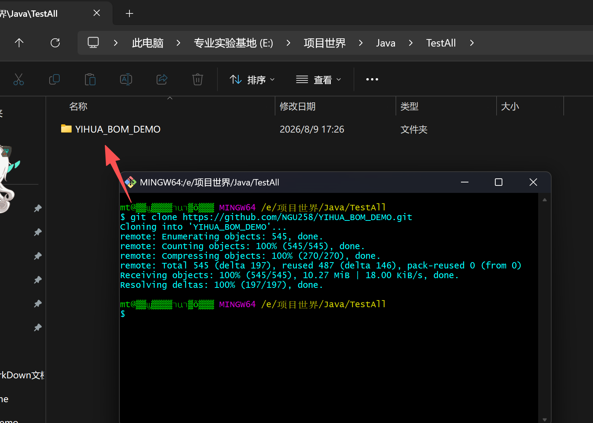
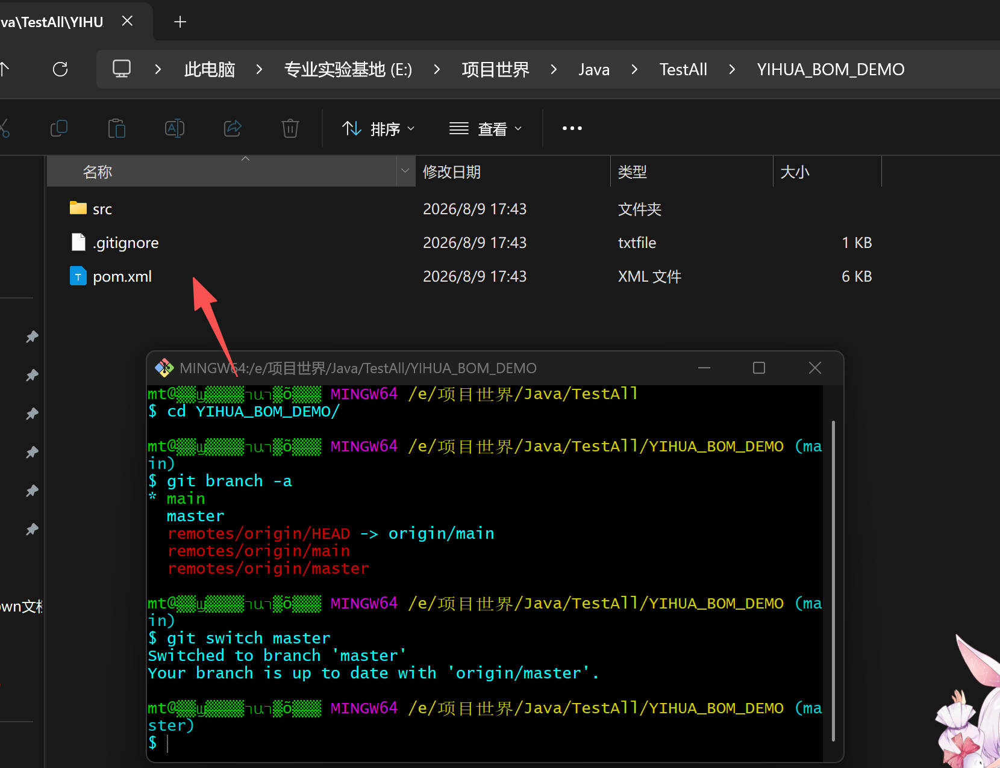
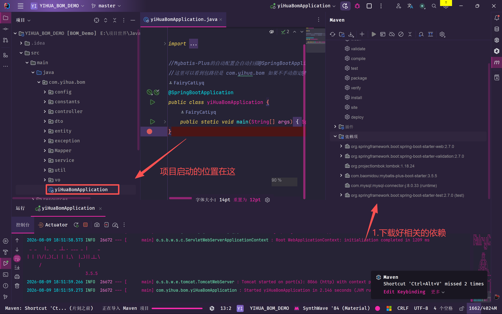
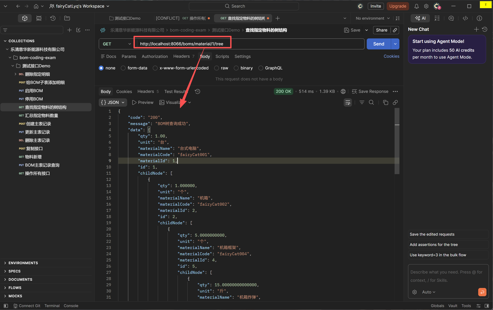
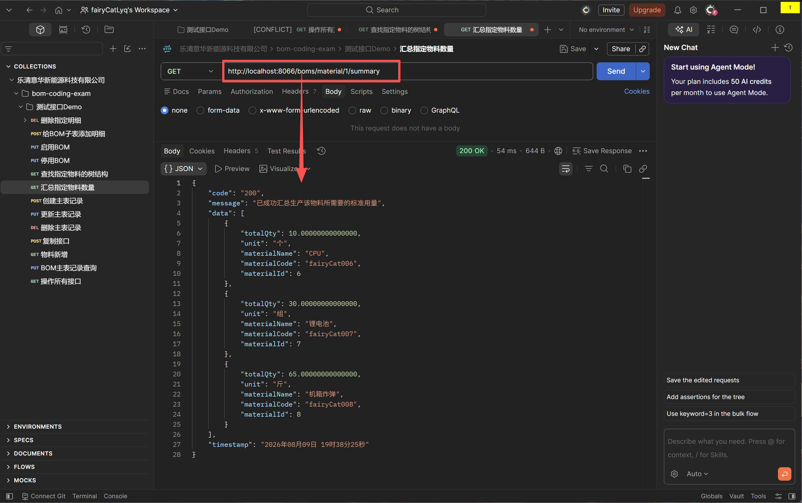
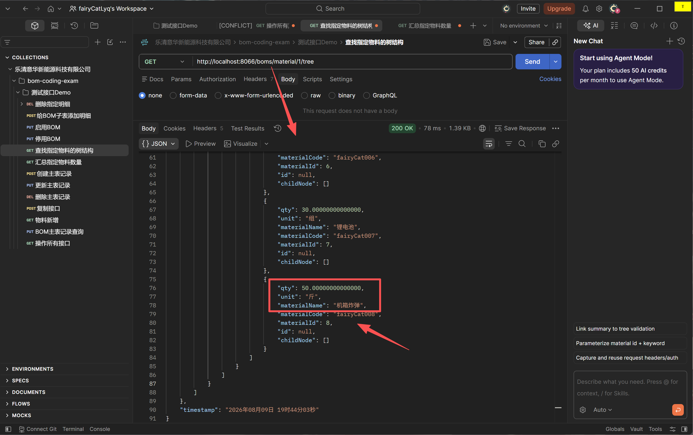

# 项目名：简化版BOM管理项目


## 一： 项目背景 

​		公司需要在 MES 系统中维护每个产品的BOM。BOM是一个树形结构，被用来描述“在生产一个成品或半成品时，需要消耗掉哪些子物料，以及这些子物料对应的标准用量是多少”。

​		项目源码(GitHub地址)： [点击查看](https://github.com/NGU258/YIHUA_BOM_DEMO/tree/master)


## 二： 已完成的功能列表

1. ### 物料接口

   1.1 支持新增物料

   1.2 支持删除物料

   1.3 支持修改物料

   1.4 支持查询物料

   1.5 支持按关键字(物料编码或物料名称)进行模糊查询，返回分页后的物料信息查询列表

   1.6 支持查询指定物料的BOM树 同时会自动累乘该物料的标准用量

   1.7 支持查询生产指定物料时需要哪些原材料，同时会自动汇总所需原材料的标准用量

* 核心接口： 1.6【BOM展开接口】、1.7【原材料汇总接口 】

2. ### BOM主表接口

  2.1 支持新增BOM主表记录

  2.2 支持删除BOM主表记录，同时相关联的子表记录也会一起被递归删除

  2.3 支持查询BOM主表记录，同时相关联的子表记录也会一起被查出来

  2.4 支持修改BOM主表记录

  2.5 支持复制BOM，包括BOM主表跟相关联的BOM明细，接口逻辑会自动维护父子关系

  2.6 支持按关键字(物料编码或物料名称)进行模糊查询，返回分页后的BOM主表查询列表

  2.7 支持启用BOM

  2.8 支持停用BOM

* 核心接口： 1.2【删除BOM主表】、1.3【查询BOM主表】、 1.5【BOM复制版本接口】

3. ### BOM子表接口

  3.1 支持新增BOM明细

  3.2 支持删除指定BOM子表明细，同时相关联的子节点记录也会一起被递归删除

  3.3 支持修改指定BOM明细

* 核心接口： 1.2【删除BOM子表】

4. ### 已实现的业务规则校验

  4.1 物料编码不能重复

  4.2 BOM 编码不能重复

  4.3 同一父BOM下不能添加相同子物料

  4.4 BOM 明细中的用量 `qty` 必须大于 0

  4.5 BOM 明细中的损耗率 `loss_rate` 不能小于 0

  4.6 BOM 中不能直接添加自己作为子物料(解决了循环引用 检测逻辑在新增BOM明细逻辑中)

  4.7 删除物料时，如果该物料已经被 BOM 主表或 BOM 明细引用，不能删除

  4.8 启用某个BOM 时，同一个产品下只能有一个 `ACTIVE` 的 BOM

  4.9 查询 BOM 树时，只展开 `ACTIVE` 状态的 BOM


5.  ###历史版本功能的设计与实现

  5.1 设计思路

    * 用户执行相关操作时按照以下逻辑处理
        * 如果有草稿状态的BOM优先操作草稿BOM
        * 如果无草稿状态BOM但有启用状态BOM，优先处理它并生成对应的草稿状态BOM
        * 如果只有停用状态BOM则提示用户需要启用它才能执行相关操作
        * 如果这个物料一个BOM状态都没有则提示用户需要给该物料添加对应的BOM

  5.2 升版功能实现目前只针对于BOM主表的新增与修改接口

  * 而主表的查与删、子表的增删改查
  * 由于路径上传的是bomId 所以不管是哪个状态的BOM都可以被操作
  * 所以觉得这里可以不用加版本控制逻辑
  * 只需要在路径上控制它的bomId是草稿BomId就好了 
  * 在拿到草稿id后返回这条草稿对象在此基础上再执行相关的CRUD操作就好了 


##三、使用指南

 ### 环境准备
* java8

* apache-maven-3.6.3

* Mysql 8.0.27

  ### 开发工具

* Idea

* Navicat

* Postman

  ###环境搭建

*   一： Mysql建表SQL

  * 物料表material

  ```mysql

  #物料表
  create table if not exists `material`(
  		`id` bigint primary key auto_increment comment '主键ID', #id 已设置成自动增长 在插入数据的时候可以不指定该字段
  		`material_code` varchar(64) comment '物料编码，唯一，但可以为空',
  		`material_name` varchar(128) default NULL comment '物料名称',
  		`material_type` varchar(64) default NULL comment '物料类型【成品(product)、半成品(semi_finished)、原材料(raw_material)】',
  		`spec` varchar(64) default NULL comment '规格型号',
  		`unit` varchar(32) default NULL comment '单位',
  		`enabled` tinyint(1) default 1 comment '是否启用 0表示不启用 1表示启用 默认启用',
  		`create_time` datetime not null default current_timestamp comment '创建时间，默认值是生成记录时的系统时间(日期+时间)', #通过给默认值是时间戳的形式 在插入数据的时候可以不用指定该字段
  		`update_time` datetime not null default current_timestamp on update current_timestamp  comment '更新时间，跟创建时间格式一样，在记录数据有变化时更新', #通过给默认值是时间戳的形式 在插入数据的时候可以不用指定该字段
  		`deleted` tinyint(1) not null default 0 comment '逻辑删除标识 0代表没有逻辑删除  1代表已经逻辑删除 但实际上数据库中还是存在这条记录的',
  		unique key `uk_material_code` (`material_code`),
  		index `idx_material_name`(`material_name`),
  		index `idx_material_type`(`material_type`),
  		index `idx_spec`(`spec`),
  		index `idx_unit`(`unit`),
  		index `idx_enabled`(`enabled`),
  		index `idx_create_time`(`create_time`),
  		index `idx_update_time`(`update_time`),
  		index `idx_deleted`(`deleted`)
  )engine=innodb default charset=utf8mb4 comment="物料表";
  ```

  * BOM主表bom_header

  ```Mysql

  #BOM 主表: bom_header
  #进行了相关优化 
  # 	1. 去掉了不需要查询的索引
  #注意索引的命名要用反引号括起来 不要用单引号
  #注意这里default只是在插入时如果没有指定这列的话才会触发 如果指定了就不会触发了
  #default只对插入有效 对更新无效
  create table if not exists `bom_header`(
  	 `id` bigint primary key auto_increment  comment 'BOM主表主键',
  	 `bom_code` varchar(128) default null comment 'BOM编码，唯一但可为空一次',
  	 `bom_name` varchar(128) default null comment 'BOM名称',
  	 `product_id` bigint not null comment '产品或半成品 物料ID 对应着material表的id',
  	 `product_code` varchar(64)  default null comment '产品或半成品 物料编码',
  	 `product_name` varchar(128)  default null comment '产品或半成品 物料名称',
  	 `bom_version` varchar(32)  not null  comment 'BOM版本号',
  	 `bom_type` varchar(32) default null comment 'BOM类型，例如EBOM、MBOM、PBOM',
  	 `base_qty` decimal(12,2) default 0.00 comment '基础数量，例如生产1个成品', #这里为了方便后面的Decimal方法的计算 采用的是decimal类型 就不是int类型了
  	 `unit` varchar(64) not null comment '单位',
  	 `status` varchar(32) not null comment '状态： DRAFT草稿、ACTIVE启用、DISABLED停用',
  	 `is_default` tinyint(1) not null default 0 comment '是否默认版本',
  	 `effective_date` datetime default null comment '生效时间',
  	 `expire_date` datetime default null comment '失效时间',
  	 `remark` varchar(256) default null comment '备注',
  	 `create_time` datetime default current_timestamp comment '创建时间',
  	 `update_time` datetime default current_timestamp on update current_timestamp comment '更新时间' ,
  	 `deleted` 	tinyint(1) not null default 0 comment '逻辑删除标记 0表示未删除',
  	 index `idx_bom_name` (`bom_name`),
  	 index `idx_product_id` (`product_id`),
  	 index `idx_product_code` (`product_code`),
  	 index `idx_product_name` (`product_name`),
  	 index `idx_bom_version` (`bom_version`),
  	 index `idx_bom_type` (`bom_type`),
  	 index `idx_base_qty` (`base_qty`),
  	 index `idx_unit` (`unit`),
  	 index `idx_status` (`status`),
  	 index `idx_is_default` (`is_default`),
  	 index `idx_effective_date` (`effective_date`),
  	 index `idx_expire_date` (`expire_date`),
  	 index `idx_create_time` (`create_time`),
  	 index `idx_update_time` (`update_time`),
  	 index `idx_deleted` (`deleted`)
  )engine=innodb default charset=utf8mb4 comment="BOM主表";
  ```

  * BOM子表bom_item

  ```Mysql

  #BOM子表 bom_item
  #投料方式是正常投料： 在生产产品前拿工单去仓库里面领
  #投料方式是倒冲 这个是系统自动识别 然后扣减
  #投料方式是手工投料 是由人工手动计算的
  create table if not exists `bom_item`(
  	`id` bigint primary key auto_increment comment 'BOM子表主键',
  	`bom_id` bigint not null comment 'BOM主表ID',
  	`parent_id` bigint not null comment 'BOM子表父节点ID 如果是0的话则代表在树的第二层',
  	`material_id` bigint not null comment '子物料ID',
  	`material_code` varchar(64) default null  comment '子物料编码',
  	`material_name` varchar(128) default null comment '子物料名称',
  	`material_spec` varchar(64) default null comment '子物料规格型号',
  	`item_no` int not null  comment '行号',
  	`qty` decimal(18,4) default 0.0000 comment '标准用量',
  	`unit` varchar(32) default null comment '单位',
  	`loss_rate` decimal(12,2) default 0.00 comment'损耗率，比如0.05表示5%',
  	`fixed_loss_qty` decimal(18,4) default 0.0000 comment '固定损耗数量',
  	`issue_type` varchar(32) not null comment '投料方式： NORMAL正常投料、BACKFLUSH 倒冲 MANUAL 手工投料',
  	`process_code` varchar(64) default null  comment '使用工序编码',
  	`process_name` varchar(64) default  null comment '使用工序名称',
  	`remark` varchar(6666) default null comment "备注",
  	`create_time` datetime default current_timestamp comment '创建时间',
  	`update_time` datetime default current_timestamp on update current_timestamp comment '更新时间',
  	`deleted` tinyint(1) default 0 comment '逻辑删除标记 0表示默认没有删除',
  	index `idx_bom_id`(`bom_id`),
  	index `idx_parent_id`(`parent_id`),
  	index `idx_material_id`(`material_id`),
  	index `idx_material_code`(`material_code`),
  	index `idx_material_name`(`material_name`),
  	index `idx_material_spec`(`material_spec`),
  	index `idx_qty`(`qty`),
  	index `idx_unit`(`unit`),
  	index `idx_loss_rate`(`loss_rate`),
  	index `idx_fixed_loss_qty`(`fixed_loss_qty`),
  	index `idx_issue_type`(`issue_type`),
  	index `idx_process_code`(`process_code`),
  	index `idx_process_name`(`process_name`),
  	index `idx_create_time`(`create_time`),
  	index `idx_update_time`(`update_time`),
  	index `idx_deleted`(`deleted`)
  )engine=INNODB default charset=utf8 comment="BOM子表";
  ```

* 二：初始化测试数据SQL
  * 物料表插入SQL
  ``` Mysql
  INSERT INTO `material` 
  ( 
  	material_code,
  	material_name,
  	material_type,
  	spec,
  	unit,
  	enabled
  )VALUES
  (
  		'fairyCat001',
  		'台式电脑',
  		'product',
  		'Testgc',
  		'台',
  	  1 #注意后面就不需要再加逗号了
  ),
  (
  		'fairyCat002',
  		'机箱',
  		'semi_finished',
  		'Testgc',
  		'个',
  	  1 
  ),(
  		'fairyCat003',
  		'主板',
  		'semi_finished',
  		'Testgc',
  		'个',
  	  1 
  ),(
  		'fairyCat004',
  		'机箱框架',
  		'semi_finished',
  		'Testgc',
  		'个',
  	  1 
  ),(
  		'fairyCat005',
  		'芯片组',
  		'semi_finished',
  		'Testgc',
  		'个',
  	  1 
  ),(
  		'fairyCat006',
  		'CPU',
  		'raw_material',
  		'Testgc',
  		'个',
  	  1 
  ),(
  		'fairyCat007',
  		'锂电池',
  		'raw_material',
  		'Testgc',
  		'组',
  	  1 
  ),(
  		'fairyCat008',
  		'机箱炸弹',
  		'raw_material',
  		'Testgc',
  		'斤',
  	  1 
  );
  ```

  * BOM主表插入SQL

  ```Mysql

  insert into bom_header(
  	bom_code,
  	bom_name,
  	product_id,
  	product_code,
  	product_name,
  	bom_version,
  	bom_type,
  	base_qty,
  	unit,
  	status,
  	is_default
  )
  values(
  	"BOM-A-001",
  	"BOM-成品A-v1",
  	1,
  	"fairyCat001",
  	"台式电脑",
  	"V1",
  	"EBOM",
  	1,
  	"台",
  	"draft",
  	0
  ),
  (
  	"BOM-B-001",
  	"BOM-半成品B-v1",
  	2,
  	"fairyCat002",
  	"机箱",
  	"V1",
  	"EBOM",
  	1,
  	"个",
  	"draft",
  	0
  ),
  (
  	"BOM-C-001",
  	"BOM-半成品C-v1",
  	3,
  	"fairyCat003",
  	"主板",
  	"V1",
  	"EBOM",
  	1,
  	"个",
  	"draft",
  	0
  ),
  (
  	"BOM-D-001",
  	"BOM-半成品D-v1",
  	5,
  	"fairyCat005",
  	"芯片组",
  	"V1",
  	"EBOM",
  	1,
  	"个",
  	"draft",
  	0
  ),
  (
  	"BOM-E-001",
  	"BOM-半成品E-v1",
  	4,
  	"fairyCat006",
  	"机箱框架",
  	"V1",
  	"EBOM",
  	1,
  	"个",
  	"draft",
  	0
  );
  ```

* ​BOM子表插入SQL

  ```Mysql

  insert into bom_item(
  	bom_id,
  	parent_id,
  	material_id,
  	material_code,
  	material_name,
  	material_spec,
  	item_no,
  	qty,
  	unit,
  	issue_type
  )values(
  	1,
  	0,
  	2,
  	"fairyCat002",
  	"机箱",
  	"Testgc",
  	10,
  	1,
  	"个",
  	"NORMAL"
  ),(
  	1,
  	0,
  	3,
  	"fairyCat003",
  	"主板",
  	"Testgc",
  	20,
  	1,
  	"个",
  	"NORMAL"
  ),(
  	1,
  	1,
  	4,
  	"fairyCat004",
  	"机箱框架",
  	"Testgc",
  	10,
  	5,
  	"个",
  	"NORMAL"
  ),(
  	1,
  	2,
  	5,
  	"fairyCat005",
  	"芯片组",
  	"Testgc",
  	10,
  	5,
  	"个",
  	"NORMAL"
  ),(
  	1,
  	4,
  	6,
  	"fairyCat006",
  	"CPU",
  	"Testgc",
  	20,
  	1,
  	"个",
  	"NORMAL"
  ),(
  	1,
  	4,
  	7,
  	"fairyCat007",
  	"锂电池",
  	"Testgc",
  	30,
  	3,
  	"组",
  	"NORMAL"
  ),(
  	1,
  	3,
  	8,
  	"fairyCat008",
  	"机箱炸弹",
  	"Testgc",
  	30,
  	3,
  	"斤",
  	"NORMAL"
  ),(
  	1,
  	4,
  	8,
  	"fairyCat008",
  	"机箱炸弹",
  	"Testgc",
  	40,
  	5,
  	"斤",
  	"NORMAL"
  );
  ```

* 三、数据库配置方式

  * 打开Navicat后新建Mysql连接，建立好后右击新建数据库
  * 配置信息如下图
  * 
  * 最后新建一个查询 把前面的SQL代码都粘贴过去运行就可以了

## 项目拉取

* 安装好Git工具后,执行以下命令将本项目代码拉取到本地

  ```
  git clone https://github.com/NGU258/YIHUA_BOM_DEMO.git
  ```

* 

* 然后cd进去git管控的区域， 执行以下命令就可以看到源码了

* ``` git
  cd YIHUA_BOM_DEMO/
  git branch -a
  git switch master
  ```


* 


## 项目启动方式

* 用Idea打开刚刚拉下来的项目，然后找到src目录下的yiHuaBomApplication类，启动它就好了
* 注意在启动前要给Idea配置成jdk8 然后配置下相应的Maven环境并下载好依赖才行
* 

## 接口调用示例

* 在成功启动项目后，就可以打开Postman进行测试了

* 1. BOM展开接口调用示例

  ``` 
  //查询物料id是1的这个物料对应的BOM
  http://localhost:8066/boms/material/1/tree
  ```

  

* 上图查询结果中最后面的原材料【机箱炸弹】原本存到数据库中的标准用量是3

* 在经过前面父节点标准用量的累乘后1 * 1 * 5 * 3最终的结果就是15 

* 也就是说生产一台台式电脑其中的一条分支需要用到15斤机箱炸弹(测试数据)

  ​

* 2. 原材料汇总接口调用示例

* ```
  //查询生产1(物料id)这个物料总共需要耗费多少原材料
  http://localhost:8066/boms/material/1/summary
  ```

* 

* 可以看到生产1(台式电脑)这个物料总共需要用到10个CPU、30组锂电池、65斤机箱炸弹

* 关于机箱炸弹的总标准用量是65的分析

* 前面在BOM展开接口中提到1这个物料对应的BOM树中有一条分支需要用到15斤机箱炸弹

* 但其实还有其它分支也会用到该原材料(机箱炸弹)

* 前面初始插入的测试数据中这颗树下总共只弄了两条分支

* 而另一条分支机箱炸弹的总标准用量其实是50斤 如下图所示

* 

* 所以加起来就是65斤 符合预期 测试通过